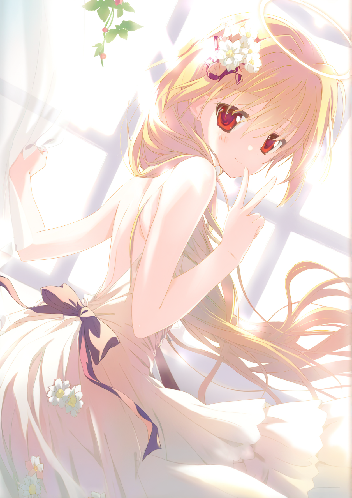
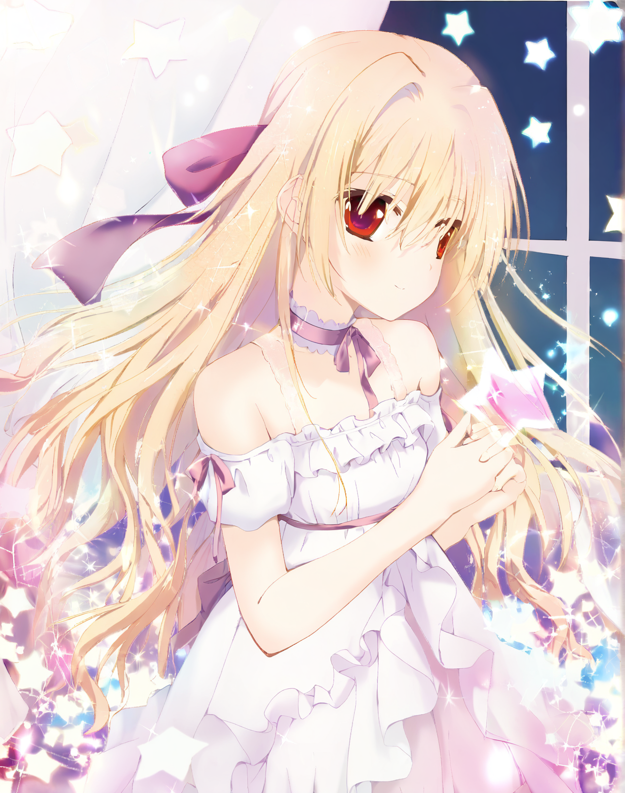
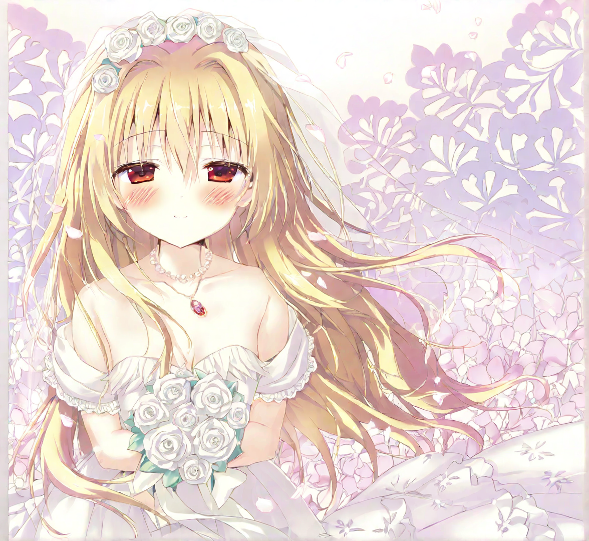
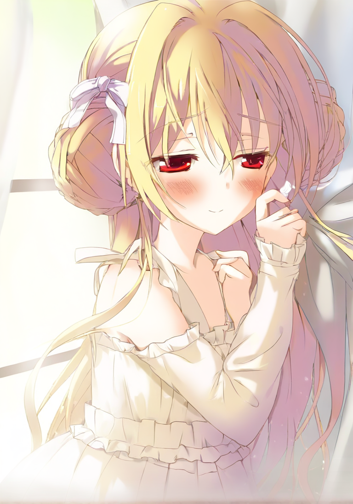

# Nikaidou Shinku Character LoRA — Illustrious XL v2.0 Stable

角色 LoRA 模型，用于生成《五彩斑斓的世界》（いろとりどりのセカイ）中**二阶堂真红**（Nikaidou Shinku）角色。A character LoRA for the visual novel character Nikaidou Shinku from "Irotoridori no Sekai".

## 🖼️ Samples

| | | |
|---|---|---|
|  |  |  |
|  |  |  |

## 📋 Usage

### Base Model
**Illustrious XL v2.0 Stable** or any Illustrious XL v2.0 compatible checkpoint.

### Prompt Format
```
nikaidou_shinku, blonde hair, red eyes, [outfit], [hairstyle], [pose], [scene]
```

- **`nikaidou_shinku`** — trigger word, always put first
- **`blonde hair`** `red eyes` — required for character consistency
- Hairstyle, outfit, pose, and scene are flexible — no strict requirements

### Recommended Settings

| Parameter | Value |
|---|---|
| LoRA Weight | **0.8** |
| Trigger Word | `nikaidou_shinku` |

> Weight 0.8 is sufficient for most cases. Increase to 0.9 if character features are not strong enough.

## 🏋️ Training Details

| Parameter | Value |
|---|---|
| Base Model | Illustrious XL v2.0 Stable |
| Dataset | 104 CG + 36 illustration images (140 total) |
| Resolution | 1536 (bucket 1024–1536) |
| Network | LoRA, dim=32, alpha=16 |
| Optimizer | AdamW8bit |
| Learning Rate | UNet 1e-4, TE 3e-5 |
| LR Scheduler | cosine_with_restarts, 3 cycles, warmup 100 |
| Epochs | 10, batch size 4 |
| Precision | bf16 train, fp16 save |
| Min SNR Gamma | 5 |
| Noise Offset | 0.0357 |
| Clip Skip | 1 |
| Keep Tokens | 1, caption dropout 5% |
| Training Platform | Kohya SS SDXL (AutoDL RTX 5090 32GB) |

## 📄 License

This LoRA model is released under the MIT License. See [LICENSE](LICENSE) for details.

## 🔗 Character Info

Nikaidou Shinku (二阶堂真红) is the main heroine of the visual novel *Irotoridori no Sekai* (五彩斑斓的世界) by FAVORITE.
